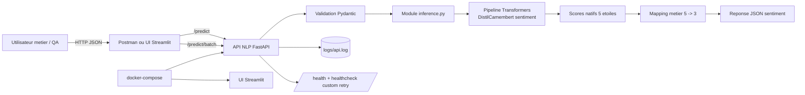

# M0-B2 - README Personnalise (Aubergine Hotels)

## Objectif

Ce bloc met en production un service de sentiment FR base sur `cmarkea/distilcamembert-base-sentiment`.
Le modele sort 5 classes etoiles (`1 star` a `5 stars`) et le metier exige 3 classes
(`negatif`, `neutre`, `positif`).

Le projet contient :

- une API FastAPI (`/health`, `/info`, `/predict`, bonus `/predict/batch`)
- une UI Streamlit
- une collection Postman de validation fonctionnelle

## Schema d'architecture (Mermaid)



## Analyse de reviews mal classees (>= 3)

Echantillon d'analyse qualitative de cas piege observables sur des avis clients FR.

| Review | Prediction modele | Attendu metier | Hypothese |
|---|---|---|---|
| "Genial, encore une nuit sans chauffage, quel bonheur..." | neutre | negatif | **Ironie** : le modele capte des termes positifs de surface (`Genial`, `bonheur`) et manque le second degre. |
| "Ce n'est pas mauvais, mais ce n'est clairement pas excellent non plus." | positif | neutre | **Negation** : double negation partielle et formulation attenuee, difficile a projeter dans une classe tranchee. |
| "Mieux que l'hotel d'en face, mais tres loin de nos attentes." | positif | negatif | **Comparatif** : le segment `mieux que` peut surpondere le positif local alors que la conclusion globale est negative. |
| "Equipe adorable, chambre minuscule, petit-dej correct, insonorisation catastrophique." | neutre | negatif | **Mixte** : coexistence d'indices positifs et negatifs forts, le modele moyenne au lieu de prioriser le signal critique. |
| "J'ai adore l'emplacement, je deteste le rapport qualite/prix." | neutre | neutre (ou negatif selon politique) | **Ambivalence** : avis reellement bipolaire; la prediction neutre peut etre defendable mais doit etre contextualisee metier. |

Conclusion operationnelle : les erreurs les plus couteuses pour Aubergine Hotels sont les faux positifs
sur des avis contenant sarcasme, negation ou comparaison. Ce sont des cas ou la formulation est
linguistiquement positive en surface mais experientialement negative.

## Justification du seuil de mapping 5 etoiles -> 3 classes

Mapping retenu dans l'API :

- `1 star`, `2 stars` -> `negatif`
- `3 stars` -> `neutre`
- `4 stars`, `5 stars` -> `positif`

Ce choix est volontairement simple et lisible pour un premier service metier, mais il repose sur une logique
de risque. Cote operations hotelieres, classifier a tort un avis reellement negatif en `positif`
(faux positif) est plus dangereux que l'inverse : l'equipe peut passer a cote d'un irritant client
important (proprete, bruit, accueil, securite), ce qui degrade la satisfaction et les notes futures.

En conservant `3 stars` comme classe `neutre` unique, on traite explicitement les retours moyens,
souvent ambivalents, sans les forcer artificiellement vers `positif` ou `negatif`. Ce point est
important car une partie des avis hôteliers contient des compromis (bon emplacement mais service lent,
ou chambre correcte mais petit-dejeuner decevant). Le neutre sert donc de zone tampon analytique.

Pourquoi ne pas basculer `4 stars` en neutre ? Parce qu'en pratique `4 stars` correspond souvent
a une experience globalement satisfaisante avec reserves mineures. Le basculer en neutre ferait
augmenter artificiellement le volume d'alertes operationnelles et diminuerait la lisibilite des KPI.
Inversement, remonter `2 stars` en neutre masquerait trop de signaux d'insatisfaction.

Ce mapping est donc un compromis metier :

- precision raisonnable sur les cas clairement positifs/negatifs
- protection contre les faux positifs les plus couteux
- categorie `neutre` reservee aux avis reellement moyens (principalement 3 etoiles)

Le README recommande de revisiter ce choix apres mesure sur un jeu annote interne
(matrice de confusion + cout metier par type d'erreur).

## Collection Postman completee

La collection inclut des requetes nominales et des cas limites (>= 5 requis) :

- `GET /health`
- `GET /info`
- `POST /predict` positif
- `POST /predict` negatif
- `POST /predict` texte vide (422)
- `POST /predict` texte blanc (422)
- `POST /predict` champ manquant (422)
- `POST /predict/batch` lot mixte (bonus)
- `POST /predict/batch` liste vide (422)
- `POST /predict/batch` element blanc (422)

Fichier : `squelette/postman/M0-B2_collection.json`

## Bonus 1 - Healthcheck custom avec retry

Un script applicatif dedie est ajoute : `services/api-nlp/app/healthcheck.py`.

Le `docker-compose.yml` utilise maintenant :

```yaml
healthcheck:
    test: ["CMD", "python", "-m", "app.healthcheck"]
```

Le script tente plusieurs appels courts a `/health` avant echec final.
Parametres pilotables par variables d'environnement :

- `HEALTHCHECK_RETRIES`
- `HEALTHCHECK_DELAY_SECONDS`
- `HEALTHCHECK_TIMEOUT_SECONDS`

## Bonus 2 - Endpoint /predict/batch

Endpoint implemente : `POST /predict/batch`

Format d'entree :

```json
{
    "textes": [
        "Service impeccable.",
        "Nuit horrible, tres bruyant."
    ]
}
```

Format de sortie :

```json
{
    "count": 2,
    "predictions": [
        {
            "sentiment": "positif",
            "scores_5_stars": {
                "1 star": 0.01,
                "2 stars": 0.03,
                "3 stars": 0.08,
                "4 stars": 0.23,
                "5 stars": 0.65
            },
            "model_name": "cmarkea/distilcamembert-base-sentiment",
            "latence_ms": 11.8
        }
    ]
}
```

Validation appliquee :

- liste non vide (`1..100` textes)
- chaque texte non blanc
- longueur max par texte respectee (`MAX_TEXT_LENGTH`)