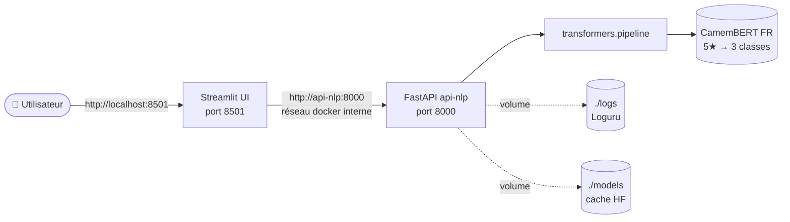

# Docker Compose — Mini-cours

> Brief associé : M0-B2
> Durée de lecture : ~30 min
> Pré-requis : avoir lu `02_Docker_essentiel.md` de M0-B1 (Dockerfile, image,
> conteneur, `docker run`)

## Pourquoi cette techno ?

Un service IA en prod, c'est **rarement un seul conteneur**. Tu as au
minimum une API qui sert le modèle, une UI pour les utilisateurs, parfois
un cache (Redis), une base de données, un proxy (nginx)… Lancer tout ça à
la main avec `docker run` devient vite ingérable : il faut gérer
manuellement les ports, les réseaux, les volumes, l'ordre de démarrage.

**Docker Compose** déclare toute la stack dans un seul fichier
`docker-compose.yml`, et l'orchestre en une commande (`docker compose up`).
C'est la brique d'orchestration **mono-machine** standard de l'industrie
pour le développement local, le testing et les déploiements simples.

Alternatives connues :
- **Kubernetes** : pour la prod multi-machines (orchestration distribuée).
  Beaucoup plus lourd, hors scope M0.
- **Podman Compose** : drop-in remplaçant Docker Compose, syntaxe quasi
  identique. Pertinent si tu es chez Red Hat / RHEL.
- **`docker run` + shell scripts** : OK pour 1-2 conteneurs, ingérable à 5+.

Dans M0-B2, on orchestre **2 services** : `api-nlp` (FastAPI + CamemBERT)
et `ui-streamlit` (UI utilisateur). Compose gère le réseau interne, les
volumes pour le cache modèle, et un healthcheck industriel.

## Vue d'ensemble de la stack M0-B2



Garde ce schéma en tête : 2 conteneurs sur un réseau privé Docker, 2
volumes persistés sur l'hôte. Le reste du mini-cours détaille chaque
brique.

## Concepts clés

- **Service** : une définition de conteneur (image, build, ports, env,
  volumes, dépendances). Un service peut tourner en plusieurs instances
  (`replicas`), mais en dev on reste à 1.
- **Réseau interne** : par défaut, tous les services d'un même
  `docker-compose.yml` partagent un réseau privé. Ils se résolvent par
  **nom de service** (pas par `localhost`). Ex : depuis `ui-streamlit`,
  l'API se contacte via `http://api-nlp:8000`, pas `localhost:8000`.
- **Volume bind-mount** : `./host/path:/container/path` monte un dossier
  de l'hôte dans le conteneur. Indispensable pour persister des données
  entre `down` et `up` (par ex. le cache HF qui pèse 270 Mo).
- **Healthcheck** : commande exécutée périodiquement par Docker pour
  vérifier qu'un service est vivant. Visible dans `docker compose ps`
  (`healthy` / `unhealthy` / `starting`). Permet à `depends_on` d'attendre
  qu'un service soit *prêt*, pas juste *démarré*.
- **`depends_on`** : ordonne le démarrage. Avec `condition: service_healthy`,
  un service attend que sa dépendance soit `healthy` (et pas seulement
  qu'elle ait démarré).

## Exemple minimal qui tourne

```yaml
# docker-compose.yml
services:
  api-nlp:
    build: ./services/api-nlp        # build depuis le Dockerfile local
    ports:
      - "8000:8000"                  # hôte:conteneur
    env_file:
      - .env                         # variables métier injectées depuis .env
    environment:
      HF_HOME: /app/models           # chemin interne, non configurable par l'apprenant
    volumes:
      - ./models:/app/models         # cache HF persisté sur l'hôte
    healthcheck:
      # On utilise `python -c "urllib..."` plutôt que `curl --fail` parce
      # que l'image `python:3.11-slim` n'embarque pas curl. Installer curl
      # juste pour le healthcheck alourdirait l'image inutilement.
      test: ["CMD", "python", "-c",
             "import urllib.request; urllib.request.urlopen('http://localhost:8000/health', timeout=2)"]
      interval: 30s
      timeout: 5s
      retries: 3
      start_period: 40s              # tolérance au boot (modèle à charger)

  ui-streamlit:
    build: ./services/ui-streamlit
    ports:
      - "8501:8501"
    environment:
      API_URL: http://api-nlp:8000   # nom de service docker, pas localhost
    depends_on:
      - api-nlp                      # attend que api-nlp soit démarré

networks:
  default:
    driver: bridge                   # réseau par défaut, partagé entre services
```

> 💡 **`env_file:` vs `environment:`** — `env_file: - .env` injecte toutes
> les variables du fichier en bloc. `environment:` déclare les variables
> en dur (utile pour les valeurs internes au conteneur comme `HF_HOME`).
> On combine les deux : variables métier configurables via `.env`,
> variables techniques en dur. Si le `.env` est absent, Compose plante
> avec `env file not found` — fail-fast côté Docker, pas besoin de check
> Python.

Lancement :

```bash
docker compose up --build            # build + start tous les services
docker compose ps                    # statut + healthcheck
docker compose logs -f api-nlp       # logs en temps réel
docker compose down                  # stop + remove (volumes conservés)
```

Versions utilisées : Docker Compose v2 (intégré à Docker Desktop ≥ 4.0).
La commande historique `docker-compose` (avec un tiret) est v1, dépréciée.

## Exercice guidé

Ouvre le `docker-compose.yml` du squelette M0-B2 et réponds à ces questions
de tête. **Ne déroule la réponse qu'après avoir cherché toi-même dans le
fichier.**

1. Quels ports sont exposés sur l'hôte ?

   <details><summary>▶ Voir la réponse</summary>

   `8000` pour l'API NLP, `8501` pour l'UI Streamlit.

   </details>

2. Quel volume est monté pour persister le cache modèle HF ?

   <details><summary>▶ Voir la réponse</summary>

   `./models:/app/models` — le cache HF est conservé sur l'hôte entre les
   redémarrages, sinon le modèle (~270 Mo) serait re-téléchargé à chaque
   `docker compose up`.

   </details>

3. Pourquoi l'UI Streamlit utilise-t-elle `http://api-nlp:8000` et pas
   `http://localhost:8000` ?

   <details><summary>▶ Voir la réponse</summary>

   `api-nlp` est le **nom de service docker**, résolu par Docker sur le
   réseau interne du compose. `localhost` désignerait le conteneur
   Streamlit lui-même, qui ne tourne pas l'API → `Connection refused`.

   </details>

4. Que se passe-t-il si le modèle ne se charge pas au démarrage ?

   <details><summary>▶ Voir la réponse</summary>

   Politique **fail-fast** : l'exception remonte dans le `lifespan`,
   uvicorn s'arrête, le conteneur exit, le healthcheck Docker bascule
   en `unhealthy`. Tu vois immédiatement le problème dans
   `docker compose ps` (pas d'API zombie qui répond OK alors que le
   modèle est cassé).

   </details>

Lance la stack avec `docker compose up --build`. Au bout de ~40 s,
`docker compose ps` doit afficher :

```
NAME                  STATUS                  PORTS
m0b2-api-nlp          Up X (healthy)          0.0.0.0:8000->8000/tcp
m0b2-ui-streamlit     Up X                    0.0.0.0:8501->8501/tcp
```

Vérifie ensuite :

```bash
curl http://localhost:8000/health   # depuis l'hôte → OK car port mappé
# Depuis dans le conteneur UI Streamlit :
docker compose exec ui-streamlit curl http://api-nlp:8000/health   # OK
docker compose exec ui-streamlit curl http://localhost:8000/health # KO
```

## Quand faut-il rebuild ?

`docker compose up` ne rebuild **pas** l'image si elle existe déjà. C'est
un piège fréquent quand on modifie le code ou les deps :

| Modification | Rebuild nécessaire ? | Commande |
|---|---|---|
| Code Python (si bind-mount) | ❌ non — uvicorn `--reload` ou redémarrage conteneur suffit | `docker compose restart api-nlp` |
| Code Python (sans bind-mount) | ✅ oui | `docker compose up --build` |
| `requirements.txt` | ✅ oui | `docker compose up --build` |
| `Dockerfile` | ✅ oui | `docker compose up --build` |
| Variable d'environnement du `.env` | ⚠️ down + up (pas restart) | `docker compose down && docker compose up` |
| `docker-compose.yml` (ports, volumes, env) | ⚠️ down + up | `docker compose down && docker compose up` |
| Healthcheck du compose | ⚠️ down + up | `docker compose down && docker compose up` |

Dans le squelette M0-B2, **le code Python n'est pas bind-mounté** (il est
`COPY` dans l'image au build). Donc toute modif de `app/main.py`,
`inference.py` etc. nécessite `--build`. C'est volontaire : reproduit
fidèlement le comportement prod où on ne modifie pas le code à chaud.

## Pièges fréquents

| Piège | Conséquence |
|---|---|
| Utiliser `localhost` au lieu du nom de service dans un `environment` (côté UI) | `Connection refused` côté client — `localhost` désigne le conteneur lui-même |
| Oublier `--build` après modif du Dockerfile ou `requirements.txt` | Les nouvelles deps ne sont pas dans l'image, `ModuleNotFoundError` au runtime |
| Conflit de ports avec un service hôte (PostgreSQL local sur 8000, etc.) | `bind: address already in use` au démarrage |
| Modifier le `docker-compose.yml` sans `down` puis `up` | Certaines modifs (ports, env, volumes) ne sont pas appliquées au simple `restart` |
| Healthcheck avec un `start_period` trop court | Service marqué `unhealthy` à tort pendant le chargement du modèle (40-60 s pour CamemBERT) |
| `depends_on` sans `condition: service_healthy` | Un service B démarre avant que A soit *prêt* (juste *démarré*), provoque des `connection refused` éphémères |

Symptôme → cause probable :

| Symptôme | Cause probable |
|---|---|
| `Connection refused` depuis l'UI vers l'API | Mauvaise URL (`localhost` au lieu du nom de service docker) |
| Service `unhealthy` qui reste bloqué après 1 min | Healthcheck mal écrit (URL inaccessible depuis l'intérieur du conteneur) ou `start_period` trop court |
| `Error response from daemon: driver failed programming external connectivity` | Port hôte déjà occupé par un autre process (souvent 8000 pris par un FastAPI local) |
| `ModuleNotFoundError` après une modif `requirements.txt` | Tu as relancé sans `--build`, l'image est l'ancienne |
| `docker compose down` perd toutes mes données | Pas de bind-mount sur le dossier de données — il faut un volume nommé ou un `./host:/container` |
| `compose: command not found` | Tu as Docker v1 (`docker-compose` avec tiret), mets à jour vers Docker Desktop ≥ 4.0 |

## Pour aller plus loin

- Doc officielle Compose : <https://docs.docker.com/compose/>
- Référence du format `compose-spec` : <https://github.com/compose-spec/compose-spec/blob/main/spec.md>
- Healthcheck patterns (tutoriel) : <https://docs.docker.com/engine/reference/builder/#healthcheck>
- Repo de référence (multi-service Python) : <https://github.com/docker/awesome-compose/tree/master/fastapi>
- Bouteille AAA : **Docker in Action (2ᵉ éd.)**, J. Nickoloff & S. Kuenzli — chapitre 11 sur Compose

## Vérification (checklist apprenant)

- [ ] Je peux expliquer la différence entre `docker run` et `docker compose up` à un collègue en 2 minutes
- [ ] Je sais que dans un réseau Compose, deux services se contactent par **nom de service**, pas par `localhost`
- [ ] Je sais lancer la stack du squelette M0-B2 avec `docker compose up --build` et la stopper proprement avec `docker compose down`
- [ ] Je sais lire `docker compose ps` et identifier un service `healthy` vs `unhealthy`
- [ ] Je sais où sont définis le healthcheck, le volume de cache modèle et le réseau interne dans le `docker-compose.yml` du brief
- [ ] J'ai compris pourquoi `start_period: 40s` est important pour un service qui charge un modèle au boot