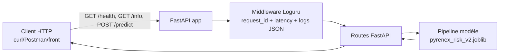
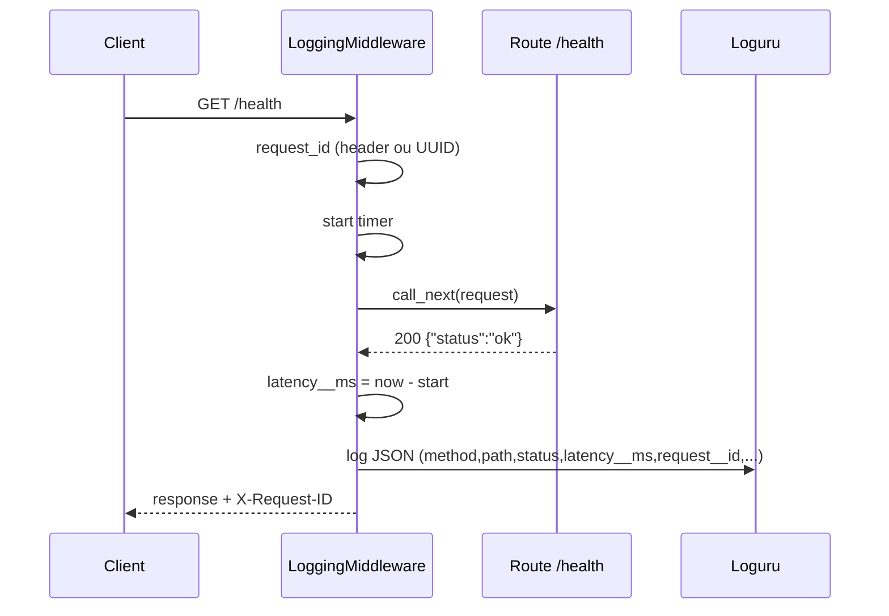

# M1-B2 — Squelette repo (Pyrenex Crédit scoring API)

> **Repo template GitHub.** Clique sur **« Use this template »** en haut à
> droite de cette page → **Create a new repository** → nomme-le
> `M1-B2-scoring-api-<prénom>` sur **ton** compte GitHub personnel.
> C'est ce nouveau repo que tu cloneras pour travailler.

---

## 🚀 Démarrage

```bash
docker build -t pyrenex-risk-api:v0.1.0 .
docker run -d -p 8000:8000 --name pyrenex-api pyrenex-risk-api:v0.1.0
curl http://localhost:8000/health
```

---

## 🏗️ Schéma global (Client → API → Modèle)



---

## 📁 Structure du repo

```
M1-B2-scoring-api-<prenom>/
├── app/
│   ├── __init__.py
│   ├── main.py                  # FastAPI app + lifespan + routes
│   ├── schemas.py               # Pydantic schemas (LoanApplication, Prediction)
│   └── middleware.py            # LoggingMiddleware Loguru
├── tests/
│   ├── __init__.py
│   ├── conftest.py              # fixtures pytest (client + valid_payload)
│   ├── test_model_contract.py   # test 0 — valide le .joblib avant l'API
│   └── test_api.py              # tests routes /health, /info, /predict
├── models/                      # ton .joblib + .json depuis M1-B1
│   └── .gitkeep
├── logs/                        # logs rotatifs (gitignored)
│   └── .gitkeep
├── ressources/                  # 📚 mini-cours d'appui (lecture juste-à-temps)
│   ├── 01_FastAPI_Pydantic_ml_essentiel.md
│   ├── 02_Dockerfile_Python_essentiel.md
│   ├── 03_Pytest_TestClient_essentiel.md
│   ├── 04_Loguru_middleware_essentiel.md
│   ├── 05_Versionning_modele_essentiel.md
│   ├── liens_officiels.md
│   └── README.md                # ordre de mobilisation + objectifs
├── Dockerfile                   # à compléter (cf. ressources/02)
├── .dockerignore
├── .gitignore
├── requirements.txt
└── README.md (ce fichier — à compléter avec schéma Mermaid + démarrage)
```

---

## 📚 Mini-cours d'appui

Les **5 mini-cours pédagogiques** du brief sont fournis dans
[`./ressources/`](./ressources/). Lecture juste-à-temps, ~15-20 min chacun :

| Tâche | Mini-cours |
|---|---|
| Routes FastAPI + Pydantic ML | [`01_FastAPI_Pydantic_ml_essentiel.md`](./ressources/01_FastAPI_Pydantic_ml_essentiel.md) |
| Dockerfile Python production | [`02_Dockerfile_Python_essentiel.md`](./ressources/02_Dockerfile_Python_essentiel.md) |
| Tests pytest + TestClient | [`03_Pytest_TestClient_essentiel.md`](./ressources/03_Pytest_TestClient_essentiel.md) |
| Loguru middleware structuré | [`04_Loguru_middleware_essentiel.md`](./ressources/04_Loguru_middleware_essentiel.md) |
| Versionning sémantique modèle | [`05_Versionning_modele_essentiel.md`](./ressources/05_Versionning_modele_essentiel.md) |

Cf. [`./ressources/README.md`](./ressources/README.md) pour l'ordre de mobilisation détaillé.

---

## 📥 Modèle (depuis M1-B1)

**Avant tout**, copie ton modèle M1-B1 :

```bash
cp ../M1-B1-scoring-<prenom>/models/pyrenex_risk_v2.joblib ./models/
cp ../M1-B1-scoring-<prenom>/models/pyrenex_risk_v2.json   ./models/
```

Le service ne démarre pas sans ces 2 fichiers.

---

## 🧪 Exemples curl complets

```bash
curl http://localhost:8000/health
curl http://localhost:8000/info
```

```bash
curl -X POST http://localhost:8000/predict \
   -H "Content-Type: application/json" \
   -d '{
      "loan_amnt": 10000.0,
      "term": "36 months",
      "int_rate": 12.5,
      "installment": 334.21,
      "annual_inc": 60000.0,
      "dti": 18.4,
      "delinq_2yrs": 0,
      "fico_range_low": 690,
      "revol_util": 45.2,
      "grade": "C",
      "home_ownership": "RENT",
      "verification_status": "Verified",
      "purpose": "debt_consolidation",
      "emp_length": "5 years"
   }'
```

---

## 🏷️ Versionning

- Version servie par l'API: `GET /info` puis lire `api_version` et `model_version`.
- Version du code: tag Git du release (exemple: `v0.1.0-api`).
- Vérification locale du tag: `git tag --list`.
- Vérification distante du tag: `git ls-remote --tags origin`.

---

## 🚀 Préparation M5

1. Ajouter une CI Docker dédiée tests d'intégration (build + run + checks HTTP).
2. Introduire un `Dockerfile.test` pour isoler les dépendances QA du runtime.
3. Publier l'image sur registry avec tags immuables (`vX.Y.Z` + SHA commit).
4. Ajouter scans sécurité image et dépendances (SCA + vulnérabilités).
5. Préparer auth réelle (JWT/OIDC), rate limiting et observabilité centralisée.

---

## 🧭 Démarche attendue

### Mercredi sync (2 h 15)

1. **Sanity check** : recharger le `.joblib` dans un script séparé (5 min)
2. **Squelette FastAPI** : `/health`, `/info`, `/predict` (1 h 15)
3. **Dockerfile minimal** : build + run + curl OK (30 min)
4. **Tour de table** Discord 11h30 : démo curl + discussion versionning (30 min)

### Async jeudi/vendredi matin (6 h)

5. **Contract test** d'abord (`test_model_contract.py`) puis **tests d'API**
   (≥ 3) en local **et** dans le container — **volume monté** en priorité
   (voie rapide), `Dockerfile.test` en option CI/CD (cf. mini-cours 03)
   (1 h 30)
6. **Loguru middleware** avec `request_id` + format JSON + rotation logs.
   ⚠️ **Aucune PII** dans les logs (cf. mini-cours 04) (45 min)
7. **README complet** + schéma Mermaid + tag `v0.1.0-api` (2 h)
8. **Finition** + préparation RDV vendredi (1 h 45)

Mini-cours d'appui : voir [`./ressources/`](./ressources/).

---

## ✅ Conventions de code

- Python 3.11+
- Type hints sur toutes les signatures publiques
- Pas de `print` — utiliser Loguru
- `pathlib.Path` pour les chemins (pas de `os.path`)
- Tests pytest **avec fixtures** (pas de boilerplate dupliqué)
- Loguru en **JSON** (`serialize=True`) sur fichier, coloré en console

---

## 🔎 Flux middleware Loguru (GET /health)

Le middleware intercepte chaque requête, attribue un `request_id`, mesure la
latence, écrit une trace JSON structurée, puis renvoie le header
`X-Request-ID` dans la réponse.



### Schéma FastIA — 7 clés obligatoires

- `timestamp`
- `level`
- `method`
- `path`
- `status`
- `latency__ms`
- `request__id`

Enrichissement ajouté: `endpoint` normalisé (même route, sans slash final),
et `LOG_LEVEL` pilotable par variable d'environnement.

Règle sécurité: aucune donnée de body et aucune PII n'est journalisée.

### Exemple de log JSON (une requête GET /health)

```json
{
   "text": "2026-06-08 15:23:46.737 | INFO     | app.middleware:dispatch:58 - request_completed\n",
   "record": {
      "time": "2026-06-08T15:23:46.737000+00:00",
      "level": {
         "name": "INFO"
      },
      "message": "request_completed",
      "extra": {
         "method": "GET",
         "path": "/health",
         "endpoint": "/health",
         "status": 200,
         "latency__ms": 0.42,
         "request__id": "0f4f31ce-896a-4f82-b165-b3596ca7903a"
      }
   }
}
```

---

## 🆘 Bloqué·e ?

1. **Swagger** : ouvre `http://localhost:8000/docs` — souvent le plus
   rapide pour débugger.
2. **Logs** : lis `logs/api.log` pour repérer les exceptions.
3. **Tests local d'abord, Docker ensuite** : si `pytest` est rouge en
   local, inutile de tester Docker — fix le code d'abord.
4. **`docker logs <container>`** : voir ce que le container raconte au
   démarrage.
5. Mini-cours dédiés dans [`./ressources/`](./ressources/).
